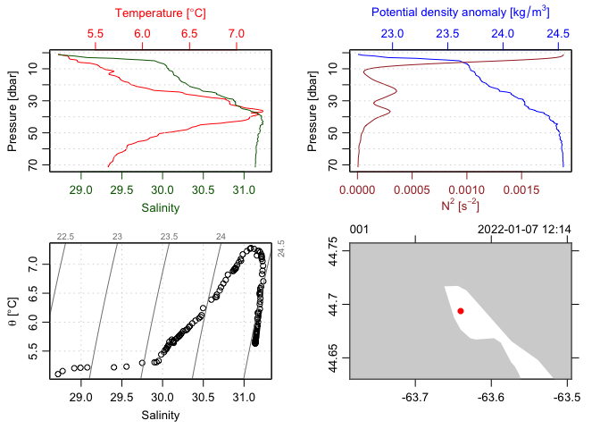

<!-- README.md is generated from README.Rmd. Please edit that file -->

# dod

<!-- badges: start -->

[](https://CRAN.R-project.org/package=dod)
<!-- badges: end -->

The goal of dod is to make it easier to download various types of
oceanographic data from common sources such as BATS, NAOO, MEDS, BBMP.

## Installation

You can install the development version of dod from
[GitHub](https://github.com/) with:

``` r
# install.packages("devtools")
devtools::install_github("AnnieHow/dod")
```

## Example

The following example shows how to (1) download an index of ctd data
files resulting from observations made as part of the BBMP program in
the year 2022 and then (2) use functions in the oce package to read and
plot the first file in that index.

``` r
# 1. Get index
library(dod)
index <- dod.ctd("BBMP", 2022, index=TRUE)
item <- index[1, "file"]
# 2. Get the first file, and plot it
file <- dod.ctd("BBMP", 2022, item)
library(oce)
#> Loading required package: gsw
plot(read.ctd(file))
```


